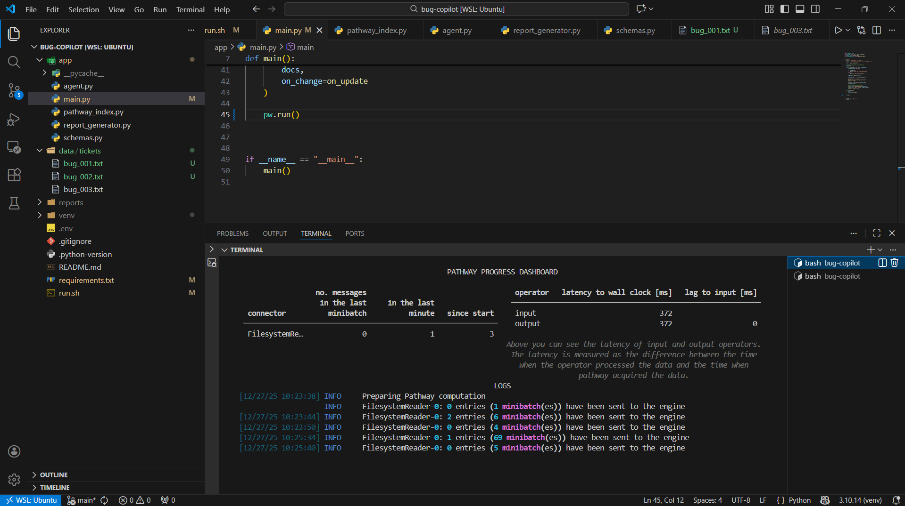
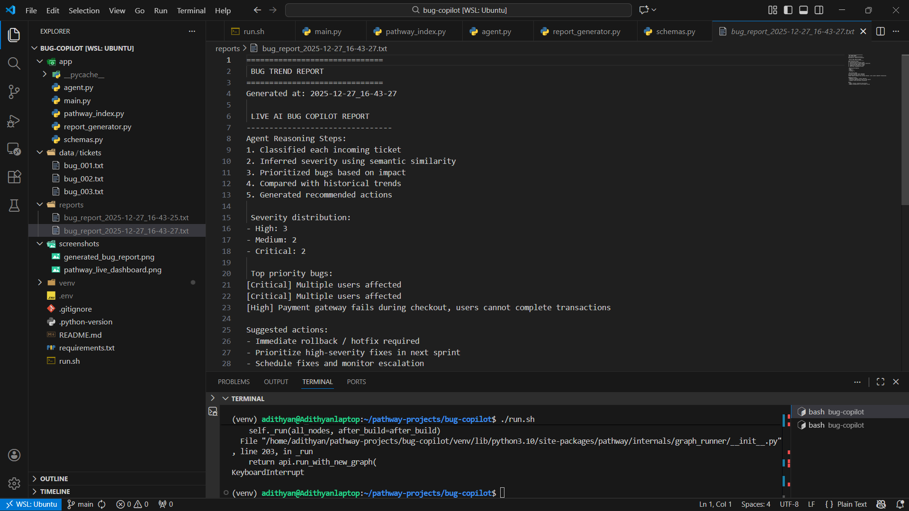

# Bug Copilot

> **Track-1 Alignment:** Bug report analyzer with live ticket feeds and report generation for longer horizons

**Bug Copilot** is a live bug report analyzer built using **Pathway’s streaming engine**.  
It enables **real-time monitoring** of bug tickets and dynamically updates bug severity, priorities, and reports as new information arrives — ensuring decisions are always based on the latest system state.

---

## Problem
Software teams receive bug reports continuously, but most bug tracking tools assign priorities once and rarely adapt as new details emerge. This leads to delayed responses, incorrect prioritization, and repeated critical issues going unnoticed.

---

## Solution
Bug Copilot introduces **real-time intelligence** into bug triaging.

- Pathway continuously monitors incoming bug tickets in real time  
- Every new or updated ticket triggers an AI agent  
- Bug severity and priorities are updated dynamically  
- Reports evolve automatically over long time horizons  

The system always reflects the **current state of the system**, without batch reprocessing or stale analysis.

---

## Why it matters (for developers)
- Reduces manual bug triaging effort  
- Helps teams focus on the most critical issues as they evolve  
- Provides clear visibility into recurring and high-risk problem areas  

---

## How it works
1. Bug tickets are added or updated in `data/tickets/`  
2. Pathway detects changes in real time  
3. An event-driven AI agent reasons over cumulative bug history  
4. Updated insights and reports are generated instantly  

---

## Demo

### Real-time monitoring with Pathway


### Automatically generated bug trend report


---

## Tech Stack
- Pathway (real-time streaming engine)  
- Python  
- SentenceTransformers (MiniLM)  

---

## Setup & Usage

### Install dependencies
```bash
pip install -r requirements.txt

## System Requirements

This project is designed to run **exclusively on a Linux (Ubuntu) environment**.

- Pathway framework requires Linux-based system support
- Native Windows execution is **not supported**
- Windows users must run the project using **WSL (Ubuntu)**

✅ Verified on Ubuntu 22.04 LTS
